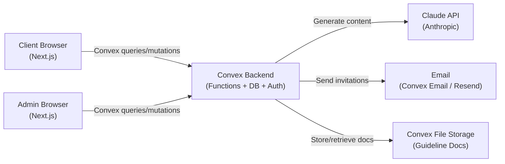

# PRD — Content Engine

## 1. Overview

### Product Summary

**Content Engine** — Helping growing businesses create content that sounds like them and actually performs — using a proven system and custom AI tools.

Content Engine is an invitation-only web application built for Lawrence's copywriting agency clients. It gives each client a dedicated workspace where they can generate on-brand content across seven content types, powered by the Claude API and informed by three layers of client-specific context: Lawrence's proprietary copywriting framework, a bespoke tone of voice document, and content-specific guidelines. Lawrence manages all workspaces, clients, and guideline documents from a central admin dashboard. Every piece of generated content is stored in a searchable library with one-click copy-to-clipboard functionality.

### Objective

This PRD covers the full MVP: client workspace access, AI content generation across seven content types, a per-client content library, a high-priority review flag for website copy and case studies, and a complete admin dashboard for workspace management, client invitations, and guideline document editing.

### Market Differentiation

Content Engine's technical implementation must deliver one thing that generic AI writing tools cannot: context-aware generation that makes each client's output meaningfully different from every other client's output. This is achieved by injecting three markdown guideline documents — tone of voice, content guidelines, and Lawrence's copywriting framework — into every Claude API call as system-level context. The quality of the output is a direct function of the quality of this context. The technical implementation must make document management easy for Lawrence and completely invisible to clients.

### Magic Moment

The magic moment is the first time a client generates content and it genuinely sounds like their brand. For this to happen, three conditions must be true: (1) Lawrence has uploaded all three guideline documents before the client's first login, (2) the content generation UI is simple enough that a client can complete their first generation without instruction, and (3) the Claude API call with injected context produces output the client recognises as their own voice. The generation flow — select type → fill brief → generate → copy — must be completable in under 3 minutes on first use.

### Success Criteria

- Time from login to first generated piece of content: < 5 minutes
- Content generation API response time: < 15 seconds (p95)
- Page load time (LCP): < 2 seconds on standard broadband
- All 7 content types generate correctly with guideline context injected
- Admin can create a workspace and invite a client end-to-end in < 5 minutes
- Copy-to-clipboard works reliably across Chrome, Firefox, Safari, and Edge
- High-priority flag displays correctly for website page copy and case studies
- Zero data leakage between client workspaces (each client sees only their own content)

---

## 2. Technical Architecture

### Architecture Overview



### Chosen Stack

| Layer | Choice | Rationale |
|---|---|---|
| Frontend | Next.js (App Router) | Modern React framework, excellent Convex integration, deploys to Vercel with zero config |
| Backend | Convex | Handles backend functions, database, auth, and file storage in one platform — TypeScript end-to-end, real-time reactivity |
| Database | Convex Database | Included with Convex — reactive queries, automatic indexing, ACID transactions |
| Auth | Convex Auth | Native auth within Convex, email/password + magic link support, no additional auth provider required |
| Payments | None | Content Engine is part of Lawrence's agency retainer; no in-app payments |
| AI | Claude API (Anthropic) | Powers all content generation via system prompt context injection |
| Email | Resend | Transactional email for client invitations; integrates cleanly with Convex actions |

### Stack Integration Guide

**Setup order:**

1. Create a new Next.js project with App Router: `npx create-next-app@latest content-engine --typescript --tailwind --app`
2. Install and initialise Convex: `npm install convex` then `npx convex dev` — this creates the `convex/` directory and links to your Convex project
3. Set up Convex Auth following the official docs — configure email/password provider in `convex/auth.ts`
4. Install the Anthropic SDK: `npm install @anthropic-ai/sdk`
5. Install Resend for email: `npm install resend`
6. Configure environment variables (see Infrastructure section)
7. Define the Convex schema in `convex/schema.ts` before writing any functions

**Key integration patterns:**

- **Convex + Next.js:** Wrap the app in `<ConvexProvider>` in `app/layout.tsx`. Use `useQuery` and `useMutation` hooks in client components. Use `fetchQuery` and `fetchMutation` in Server Components where needed.
- **Convex Auth:** Use `useAuthActions()` for sign-in/sign-out. Use `ctx.auth.getUserIdentity()` in Convex functions to get the authenticated user. User identity is available in all queries and mutations automatically.
- **Claude API from Convex:** Call the Anthropic API from Convex **actions** (not queries or mutations — actions can call external APIs). Use `internal.actions.generateContent` pattern — trigger from a mutation, run in an action, write result back to database.
- **File storage for guideline docs:** Use Convex file storage to store markdown files. Store the `storageId` in the workspace record. Retrieve file content in actions using `ctx.storage.getUrl()` and fetch the content before passing to Claude.
- **Resend from Convex:** Call Resend from a Convex action triggered when Lawrence invites a client. Pass the workspace invitation URL with a signed token.

**Common gotchas:**

- Convex functions run on Convex's infrastructure, not Next.js. Don't try to use Next.js API routes to call Convex — use the Convex client directly.
- Convex queries are reactive by default — `useQuery` will re-render components when data changes. This is a feature, not a bug.
- File content retrieval from Convex storage returns a URL, not raw content. You must `fetch()` the URL to get the markdown text before passing to Claude.
- The Anthropic SDK cannot be used directly in Convex mutations (no HTTP). Always use Convex actions for Claude API calls.
- Convex Auth requires you to set `AUTH_SECRET` in your environment — generate with `openssl rand -hex 32`.

### Repository Structure

```
content-engine/
├── app/                          # Next.js App Router
│   ├── layout.tsx                # Root layout with ConvexProvider
│   ├── page.tsx                  # Landing / redirect to login
│   ├── (auth)/
│   │   ├── login/page.tsx        # Client login page
│   │   └── accept-invite/page.tsx # Invitation acceptance flow
│   ├── (client)/                 # Client-facing routes (auth protected)
│   │   ├── layout.tsx            # Client layout with sidebar
│   │   ├── dashboard/page.tsx    # Client workspace home
│   │   ├── generate/
│   │   │   └── [type]/page.tsx   # Content generation by type
│   │   └── library/page.tsx      # Content library
│   └── (admin)/                  # Admin routes (admin role required)
│       ├── layout.tsx            # Admin layout
│       ├── dashboard/page.tsx    # Admin overview
│       ├── workspaces/
│       │   ├── page.tsx          # All workspaces list
│       │   ├── new/page.tsx      # Create workspace
│       │   └── [id]/
│       │       ├── page.tsx      # Workspace detail
│       │       └── documents/page.tsx # Manage guideline docs
│       └── clients/page.tsx      # All clients overview
├── components/
│   ├── ui/                       # Design system primitives
│   │   ├── button.tsx
│   │   ├── input.tsx
│   │   ├── card.tsx
│   │   ├── badge.tsx
│   │   ├── modal.tsx
│   │   ├── toast.tsx
│   │   └── skeleton.tsx
│   └── features/
│       ├── content/
│       │   ├── content-type-grid.tsx   # Content type selector
│       │   ├── generation-form.tsx     # Brief input form per type
│       │   ├── content-output.tsx      # Generated content display + copy
│       │   ├── high-priority-flag.tsx  # Warning banner for flagged types
│       │   └── library-card.tsx       # Content library item
│       ├── workspace/
│       │   ├── workspace-sidebar.tsx
│       │   └── workspace-header.tsx
│       └── admin/
│           ├── workspace-list.tsx
│           ├── invite-client-form.tsx
│           └── document-editor.tsx
├── lib/
│   ├── constants.ts              # Content types, config values
│   ├── utils.ts                  # cn() and shared utilities
│   └── content-types.ts          # Content type definitions and form configs
├── convex/
│   ├── _generated/               # Auto-generated by Convex CLI (do not edit)
│   ├── schema.ts                 # Database schema
│   ├── auth.ts                   # Convex Auth configuration
│   ├── workspaces.ts             # Workspace queries and mutations
│   ├── clients.ts                # Client/user queries and mutations
│   ├── content.ts                # Content library queries and mutations
│   ├── documents.ts              # Guideline document queries and mutations
│   ├── invitations.ts            # Invitation queries and mutations
│   └── actions/
│       ├── generateContent.ts    # Claude API action
│       └── sendInvitation.ts     # Resend email action
├── public/
│   └── logo.svg
├── .env.local                    # Local environment variables
├── convex.json                   # Convex project config
├── tailwind.config.ts
├── next.config.ts
└── package.json
```

### Infrastructure & Deployment

**Frontend:** Deploy to Vercel. Connect the GitHub repo, set environment variables in the Vercel dashboard. Vercel auto-deploys on push to `main`.

**Backend:** Convex Cloud (managed). Run `npx convex deploy` to deploy backend functions. Convex handles scaling, backups, and uptime automatically.

**Required environment variables:**

```env
# Convex
NEXT_PUBLIC_CONVEX_URL=https://your-project.convex.cloud
CONVEX_DEPLOY_KEY=your_deploy_key

# Convex Auth
AUTH_SECRET=your_generated_secret_32_chars

# Anthropic
ANTHROPIC_API_KEY=sk-ant-...

# Resend
RESEND_API_KEY=re_...

# App
NEXT_PUBLIC_APP_URL=https://your-app.vercel.app
ADMIN_EMAIL=lawrence@youragency.com
```

**Convex environment variables** (set via `npx convex env set`):
```
ANTHROPIC_API_KEY
RESEND_API_KEY
ADMIN_EMAIL
NEXT_PUBLIC_APP_URL
```

### Security Considerations

- **Workspace isolation:** Every Convex query and mutation must check that the authenticated user belongs to the workspace they're querying. Never return data without verifying workspace membership. Implement a `requireWorkspaceAccess(ctx, workspaceId)` helper used in every workspace-scoped function.
- **Admin role protection:** All admin routes check `user.role === "admin"` in both the Next.js layout (for UX) and in every Convex function (for security). Client-side role checks alone are insufficient.
- **Invitation token security:** Invitation tokens are single-use, expire after 7 days, and are invalidated immediately on acceptance. Store hashed tokens, not plaintext.
- **Claude API key:** Stored only as a Convex environment variable. Never exposed to the client. All Claude API calls happen server-side in Convex actions.
- **Input validation:** All mutation arguments validated using Convex's `v.*` validators. Markdown content sanitised before storage to prevent XSS if rendered as HTML.
- **Rate limiting:** Implement per-workspace generation rate limiting in the `generateContent` action — maximum 20 generations per workspace per day to prevent runaway API costs.

### Cost Estimate

| Service | Free Tier | Estimated Monthly Cost (10 clients, moderate use) |
|---|---|---|
| Convex | 1M function calls/month, 1GB storage | $0–25/month |
| Vercel | Generous free tier for Next.js | $0/month |
| Anthropic Claude API | Pay per token | ~$15–40/month (est. 200 generations × avg 1,500 tokens) |
| Resend | 3,000 emails/month free | $0/month |
| **Total** | | **~$15–65/month** |

Cost scales primarily with Claude API usage. Monitor token consumption per generation type — case studies and blog articles will be significantly more expensive than social posts.

---

## 3. Data Model

### Entity Definitions

```typescript
// convex/schema.ts

import { defineSchema, defineTable } from "convex/server";
import { v } from "convex/values";

export default defineSchema({

  // Users — both admin (Lawrence) and clients
  users: defineTable({
    name: v.string(),                          // Display name
    email: v.string(),                         // Unique email address
    role: v.union(
      v.literal("admin"),                      // Lawrence
      v.literal("client")                      // Agency clients
    ),
    workspaceId: v.optional(v.id("workspaces")), // Null for admin; set for clients
    createdAt: v.number(),                     // Unix timestamp (ms)
    lastActiveAt: v.optional(v.number()),      // Last login/action timestamp
  })
    .index("by_email", ["email"])
    .index("by_workspace", ["workspaceId"]),

  // Workspaces — one per client company
  workspaces: defineTable({
    name: v.string(),                          // Client company name
    slug: v.string(),                          // URL-safe identifier
    description: v.optional(v.string()),       // Optional internal notes from Lawrence
    isActive: v.boolean(),                     // Lawrence can deactivate workspaces
    createdAt: v.number(),
    updatedAt: v.number(),
  })
    .index("by_slug", ["slug"])
    .index("by_active", ["isActive"]),

  // Guideline documents — up to 3 per workspace
  documents: defineTable({
    workspaceId: v.id("workspaces"),
    type: v.union(
      v.literal("tone_of_voice"),             // Brand voice and tone guidelines
      v.literal("content_guidelines"),        // Content-specific rules and preferences
      v.literal("copywriting_framework")      // Lawrence's proprietary framework
    ),
    title: v.string(),                         // Display name for the document
    content: v.string(),                       // Full markdown content (stored as string)
    updatedAt: v.number(),
    updatedBy: v.id("users"),                 // Always Lawrence (admin)
  })
    .index("by_workspace", ["workspaceId"])
    .index("by_workspace_and_type", ["workspaceId", "type"]),

  // Content items — generated content stored per workspace
  content: defineTable({
    workspaceId: v.id("workspaces"),
    generatedBy: v.id("users"),               // Which client user generated it
    type: v.union(
      v.literal("blog_article"),
      v.literal("email_newsletter"),
      v.literal("website_page_copy"),
      v.literal("linkedin_post"),
      v.literal("instagram_post"),
      v.literal("x_post"),
      v.literal("case_study")
    ),
    brief: v.object({                          // The inputs provided by the client
      topic: v.optional(v.string()),
      keyMessages: v.optional(v.string()),
      targetAudience: v.optional(v.string()),
      callToAction: v.optional(v.string()),
      additionalContext: v.optional(v.string()),
      // Type-specific fields stored as additional keys
      wordCount: v.optional(v.string()),       // For blog/newsletter
      pageName: v.optional(v.string()),        // For website page copy
      subjectLine: v.optional(v.string()),     // For email newsletter
      clientName: v.optional(v.string()),      // For case studies
      results: v.optional(v.string()),         // For case studies
    }),
    output: v.string(),                        // The generated markdown/text content
    isHighPriority: v.boolean(),               // True for website_page_copy and case_study
    reviewedByAdmin: v.boolean(),              // Has Lawrence reviewed this piece
    createdAt: v.number(),
  })
    .index("by_workspace", ["workspaceId"])
    .index("by_workspace_and_type", ["workspaceId", "type"])
    .index("by_workspace_chronological", ["workspaceId", "createdAt"]),

  // Invitations — pending client invitations
  invitations: defineTable({
    workspaceId: v.id("workspaces"),
    email: v.string(),                         // Invited client's email
    token: v.string(),                         // Secure random token (hashed)
    expiresAt: v.number(),                     // Unix timestamp — 7 days from creation
    acceptedAt: v.optional(v.number()),        // Set when invitation is accepted
    createdBy: v.id("users"),                  // Always Lawrence
    createdAt: v.number(),
  })
    .index("by_token", ["token"])
    .index("by_email", ["email"])
    .index("by_workspace", ["workspaceId"]),

});
```

### Relationships

| Relationship | Type | Details |
|---|---|---|
| User → Workspace | Many:1 | Multiple clients can belong to one workspace (future); v1 is 1:1 |
| Workspace → Documents | 1:Many | Up to 3 documents per workspace (one per type) |
| Workspace → Content | 1:Many | All generated content belongs to a workspace |
| Workspace → Invitations | 1:Many | A workspace can have multiple pending invitations |
| Content → User | Many:1 | Each content item tracks which user generated it |

### Indexes

- `users.by_email` — Fast lookup when accepting invitations and during auth
- `users.by_workspace` — Fetch all users in a workspace (admin view)
- `workspaces.by_slug` — URL-based workspace routing
- `documents.by_workspace_and_type` — Fetch a specific document type for a workspace (used in generation)
- `content.by_workspace_chronological` — Library feed sorted by creation time
- `content.by_workspace_and_type` — Filter library by content type
- `invitations.by_token` — Fast token lookup during invitation acceptance

---

## 4. API Specification

### API Design Philosophy

Content Engine uses Convex's RPC-style queries and mutations — not REST endpoints. All data access goes through typed Convex functions called from the Next.js frontend via the Convex client. External API calls (Claude, Resend) happen in Convex actions.

Authentication is handled automatically by Convex Auth — every function receives `ctx.auth` which provides the authenticated user's identity. Functions call `ctx.auth.getUserIdentity()` and throw if no user is found for protected operations.

Error handling: Convex mutations throw `ConvexError` with a descriptive message for expected failures (e.g. "Workspace not found", "Invitation expired"). Unexpected errors are caught and logged.

### Queries and Mutations

**Workspaces**

```typescript
// Get all workspaces (admin only)
query("workspaces.list", {
  args: {},
  returns: v.array(v.object({
    _id: v.id("workspaces"),
    name: v.string(),
    slug: v.string(),
    isActive: v.boolean(),
    clientCount: v.number(),
    contentCount: v.number(),
    lastActivityAt: v.optional(v.number()),
    createdAt: v.number(),
  })),
})

// Get workspace for the current authenticated client
query("workspaces.getMine", {
  args: {},
  returns: v.union(v.object({ _id: v.id("workspaces"), name: v.string(), slug: v.string() }), v.null()),
})

// Get a specific workspace by ID (admin only)
query("workspaces.getById", {
  args: { workspaceId: v.id("workspaces") },
  returns: v.object({ _id: v.id("workspaces"), name: v.string(), slug: v.string(), description: v.optional(v.string()), isActive: v.boolean(), createdAt: v.number() }),
})

// Create a new workspace (admin only)
mutation("workspaces.create", {
  args: {
    name: v.string(),
    slug: v.string(),
    description: v.optional(v.string()),
  },
  returns: v.id("workspaces"),
})

// Update workspace details (admin only)
mutation("workspaces.update", {
  args: {
    workspaceId: v.id("workspaces"),
    name: v.optional(v.string()),
    description: v.optional(v.string()),
    isActive: v.optional(v.boolean()),
  },
  returns: v.null(),
})
```

**Documents**

```typescript
// Get all documents for a workspace
query("documents.listByWorkspace", {
  args: { workspaceId: v.id("workspaces") },
  returns: v.array(v.object({
    _id: v.id("documents"),
    type: v.string(),
    title: v.string(),
    content: v.string(),
    updatedAt: v.number(),
  })),
})

// Get a specific document type for a workspace
query("documents.getByType", {
  args: {
    workspaceId: v.id("workspaces"),
    type: v.union(v.literal("tone_of_voice"), v.literal("content_guidelines"), v.literal("copywriting_framework")),
  },
  returns: v.union(v.object({ _id: v.id("documents"), content: v.string(), updatedAt: v.number() }), v.null()),
})

// Create or update a document (upsert — admin only)
mutation("documents.upsert", {
  args: {
    workspaceId: v.id("workspaces"),
    type: v.union(v.literal("tone_of_voice"), v.literal("content_guidelines"), v.literal("copywriting_framework")),
    title: v.string(),
    content: v.string(),
  },
  returns: v.id("documents"),
})
```

**Content Generation**

```typescript
// Trigger content generation (client, in their workspace)
// This mutation creates a pending content record and triggers the generateContent action
mutation("content.generate", {
  args: {
    workspaceId: v.id("workspaces"),
    type: v.union(
      v.literal("blog_article"), v.literal("email_newsletter"),
      v.literal("website_page_copy"), v.literal("linkedin_post"),
      v.literal("instagram_post"), v.literal("x_post"), v.literal("case_study")
    ),
    brief: v.object({
      topic: v.optional(v.string()),
      keyMessages: v.optional(v.string()),
      targetAudience: v.optional(v.string()),
      callToAction: v.optional(v.string()),
      additionalContext: v.optional(v.string()),
      wordCount: v.optional(v.string()),
      pageName: v.optional(v.string()),
      subjectLine: v.optional(v.string()),
      clientName: v.optional(v.string()),
      results: v.optional(v.string()),
    }),
  },
  returns: v.id("content"),
})

// Internal action — called by content.generate mutation
// Fetches documents, builds system prompt, calls Claude API, saves output
internalAction("actions.generateContent", {
  args: {
    contentId: v.id("content"),
    workspaceId: v.id("workspaces"),
    type: v.string(),
    brief: v.any(),
  },
  returns: v.null(),
})
```

**Content Library**

```typescript
// Get content library for a workspace (reverse chronological)
query("content.listByWorkspace", {
  args: {
    workspaceId: v.id("workspaces"),
    type: v.optional(v.string()),   // Optional filter by content type
    limit: v.optional(v.number()), // Default 20
    cursor: v.optional(v.string()), // Pagination cursor
  },
  returns: v.object({
    items: v.array(v.object({
      _id: v.id("content"),
      type: v.string(),
      brief: v.any(),
      output: v.string(),
      isHighPriority: v.boolean(),
      reviewedByAdmin: v.boolean(),
      createdAt: v.number(),
    })),
    nextCursor: v.optional(v.string()),
  }),
})

// Get a single content item
query("content.getById", {
  args: { contentId: v.id("content") },
  returns: v.object({
    _id: v.id("content"),
    workspaceId: v.id("workspaces"),
    type: v.string(),
    brief: v.any(),
    output: v.string(),
    isHighPriority: v.boolean(),
    reviewedByAdmin: v.boolean(),
    createdAt: v.number(),
  }),
})

// Mark content as reviewed (admin only)
mutation("content.markReviewed", {
  args: { contentId: v.id("content") },
  returns: v.null(),
})
```

**Invitations**

```typescript
// Send a client invitation (admin only)
mutation("invitations.send", {
  args: {
    workspaceId: v.id("workspaces"),
    email: v.string(),
  },
  returns: v.id("invitations"),
})

// Validate an invitation token (public — no auth required)
query("invitations.validate", {
  args: { token: v.string() },
  returns: v.union(
    v.object({ valid: v.literal(true), workspaceName: v.string(), email: v.string() }),
    v.object({ valid: v.literal(false), reason: v.string() })
  ),
})

// Accept an invitation and create client account
mutation("invitations.accept", {
  args: {
    token: v.string(),
    name: v.string(),
    password: v.string(),
  },
  returns: v.object({ success: v.boolean() }),
})
```

**Users / Admin**

```typescript
// Get all clients (admin only)
query("users.listClients", {
  args: {},
  returns: v.array(v.object({
    _id: v.id("users"),
    name: v.string(),
    email: v.string(),
    workspaceId: v.optional(v.id("workspaces")),
    workspaceName: v.optional(v.string()),
    lastActiveAt: v.optional(v.number()),
    createdAt: v.number(),
  })),
})

// Get the current user's profile
query("users.me", {
  args: {},
  returns: v.union(v.object({
    _id: v.id("users"),
    name: v.string(),
    email: v.string(),
    role: v.string(),
    workspaceId: v.optional(v.id("workspaces")),
  }), v.null()),
})
```

---

## 5. User Stories

### Epic: Client Authentication & Onboarding

**US-001: Accept workspace invitation**
As a new client, I want to accept my invitation and set up my account so that I can access my workspace.

Acceptance Criteria:
- [ ] Given a valid invitation link, when I visit the URL, then I see my name, email pre-filled, and a password field
- [ ] Given a valid invitation, when I submit my details, then my account is created and I'm redirected to my workspace dashboard
- [ ] Given an expired invitation (>7 days), when I visit the URL, then I see an error message and a prompt to contact Lawrence
- [ ] Given an already-accepted invitation, when I visit the URL, then I'm redirected to the login page

**US-002: Client login**
As a returning client, I want to log in with my email and password so that I can access my workspace.

Acceptance Criteria:
- [ ] Given valid credentials, when I submit the login form, then I'm redirected to my workspace dashboard
- [ ] Given invalid credentials, when I submit the login form, then I see a clear error message without revealing which field is wrong
- [ ] Given a successful login, when I revisit the app within 7 days, then I remain logged in

---

### Epic: Content Generation

**US-003: Select content type**
As a client, I want to see and select from all available content types so that I can choose what I want to create.

Acceptance Criteria:
- [ ] Given I'm on my workspace dashboard, when I view the content types, then I see all 7 types displayed with icons and descriptions
- [ ] Given I select a content type, when the selection is confirmed, then I'm taken to the brief input form for that type
- [ ] Given I select Website Page Copy or Case Study, when the page loads, then I see the high-priority flag before filling in the brief

**US-004: Fill in a content brief**
As a client, I want to fill in a brief for my chosen content type so that the AI has enough context to generate relevant content.

Acceptance Criteria:
- [ ] Given I'm on a generation form, when I view the inputs, then I see fields relevant to the specific content type (not generic fields for all types)
- [ ] Given required fields are empty, when I try to generate, then I see validation messages indicating which fields need completing
- [ ] Given I fill in the brief and click Generate, when the request is submitted, then I see a loading state while content is being generated

**US-005: Receive and copy generated content**
As a client, I want to see the generated content and copy it to my clipboard so that I can use it immediately.

Acceptance Criteria:
- [ ] Given generation completes, when the content appears, then it displays in a clean, readable format at adequate font size
- [ ] Given I click the "Copy" button, when it's clicked, then the full content is copied to my clipboard and a confirmation message appears briefly
- [ ] Given the copied content, when I paste it elsewhere, then it contains the complete generated text with no truncation
- [ ] Given I copy successfully, when the confirmation appears, then it fades away after 2 seconds without requiring dismissal

**US-006: View content library**
As a client, I want to see all the content I've generated so that I can find and reuse previous pieces.

Acceptance Criteria:
- [ ] Given I navigate to my library, when the page loads, then I see all my generated content in reverse chronological order
- [ ] Given content items in my library, when I view a card, then I can see the content type, a preview of the content, and the date it was generated
- [ ] Given a content item, when I click the copy button on its card, then the full content is copied to my clipboard
- [ ] Given I have no content yet, when I view the library, then I see an empty state with a prompt to generate my first piece

---

### Epic: High-Priority Content

**US-007: High-priority content notification**
As a client, I want to know when content I'm generating will be reviewed by Lawrence so that I understand what to expect.

Acceptance Criteria:
- [ ] Given I select Website Page Copy or Case Study, when the form loads, then a prominent notice is displayed explaining Lawrence will review this content before it's used
- [ ] Given the high-priority notice, when I read it, then the message includes an expected review timeframe (within 48 business hours)
- [ ] Given I generate high-priority content, when it appears in my library, then it's visually marked to indicate it's pending review
- [ ] Given Lawrence marks a piece as reviewed, when I view my library, then the review indicator updates accordingly

---

### Epic: Admin — Workspace Management

**US-008: Create a client workspace**
As Lawrence (admin), I want to create a new workspace for an incoming client so that their environment is ready before I invite them.

Acceptance Criteria:
- [ ] Given I'm on the admin dashboard, when I click "New Workspace", then I'm taken to a workspace creation form
- [ ] Given a workspace form, when I submit a name and optional description, then the workspace is created and I'm taken to its detail view
- [ ] Given a duplicate workspace name, when I try to create, then I'm warned and prompted to use a different name

**US-009: Invite a client to their workspace**
As Lawrence (admin), I want to send a client an invitation to their workspace so that they can create their account and get started.

Acceptance Criteria:
- [ ] Given a workspace detail view, when I click "Invite Client", then I see a form to enter the client's email address
- [ ] Given I submit a valid email, when the invitation is sent, then the client receives an email with a personalised invitation link
- [ ] Given the invitation is pending, when I view the workspace, then I can see the pending invitation and its status
- [ ] Given I send an invitation to an already-registered user, when it's processed, then I see a clear error message

**US-010: Manage guideline documents**
As Lawrence (admin), I want to upload and edit guideline documents for each workspace so that the AI generates content appropriate to each client's brand.

Acceptance Criteria:
- [ ] Given a workspace detail view, when I navigate to Documents, then I see the three document types: Tone of Voice, Content Guidelines, Copywriting Framework
- [ ] Given an empty document slot, when I click to add content, then I see a markdown text editor
- [ ] Given I save a document, when the save completes, then the updated content is immediately used in subsequent generations for that workspace
- [ ] Given an existing document, when I edit and save it, then the previous version is replaced and the updatedAt timestamp is refreshed

**US-011: Admin dashboard overview**
As Lawrence (admin), I want to see an overview of all client workspaces so that I can monitor activity and health.

Acceptance Criteria:
- [ ] Given I'm on the admin dashboard, when the page loads, then I see all active workspaces with their client name, last activity date, and content count
- [ ] Given a workspace in the list, when I click it, then I navigate to that workspace's detail view
- [ ] Given I want to see high-priority content pending review, when I check the dashboard, then I can see a count or list of unreviewed high-priority pieces

---

## 6. Functional Requirements

### Content Generation

**FR-001: Content type selection**
Priority: P0
Description: Client workspace displays all 7 content types in a grid layout. Each type shown with an icon, name, and one-line description. Clicking a type navigates to its generation form.
Acceptance Criteria:
- All 7 types displayed on workspace dashboard
- Icons use Lucide React, consistent with the design system
- High-priority types (website_page_copy, case_study) display with no visual difference at selection stage — the flag appears on the form
Related Stories: US-003

**FR-002: Content brief forms (per type)**
Priority: P0
Description: Each content type has a dedicated form with fields specific to that type. Forms use react-hook-form with zod validation. All forms share a common layout but field sets differ.

Field definitions per content type:

- **Blog Article:** Topic/title (required), Key messages (optional), Target audience (optional), Approximate word count (select: 500, 800, 1200, 1500+), Additional context (optional)
- **Email Newsletter:** Subject line idea (required), Main topic (required), Key messages (optional), Call to action (required), Additional context (optional)
- **Website Page Copy:** Page name (required, e.g. "About Us", "Services"), Page purpose (required), Key messages (required), Target audience (optional), Existing copy to reference or improve (optional)
- **LinkedIn Post:** Topic/angle (required), Key message (required), Call to action (optional), Additional context (optional)
- **Instagram Post:** Topic (required), Mood/angle (optional), Call to action or hashtag direction (optional), Additional context (optional)
- **X Post:** Topic (required), Key message (required), Additional context (optional)
- **Case Study:** Client name (required), Problem/challenge (required), Solution provided (required), Results/outcomes (required), Additional context (optional)

Acceptance Criteria:
- Required fields validated before generation is triggered
- Form state preserved if user navigates away and returns
- Submit button disabled during generation to prevent double-submission
Related Stories: US-004

**FR-003: High-priority content flag**
Priority: P0
Description: Website Page Copy and Case Study generation forms display a prominent notice before the brief inputs. The notice communicates that this content type is reviewed by Lawrence before use.

Notice text: "This is a high-priority content type. Lawrence reviews all website copy and case studies before they go live. Fill in your brief and generate — your content will be ready within 48 business hours."

Display: A banner using `--color-warning` (#F59E0B) background at reduced opacity (10%), with a warning icon (Lucide `AlertTriangle`) and the notice text. Positioned above the form fields.

Acceptance Criteria:
- Banner visible immediately on page load for flagged content types
- Banner cannot be dismissed — it's informational, not an alert
- Content generation proceeds normally — the flag is a notice, not a gate
Related Stories: US-007

**FR-004: Claude API content generation**
Priority: P0
Description: When a client submits a brief, a Convex mutation creates a content record and triggers a Convex action that calls the Claude API. The action builds a system prompt from the three workspace guideline documents and a user prompt from the brief, then saves the output back to the content record.

System prompt construction:
```
You are an expert copywriter working for [workspace name].

COPYWRITING FRAMEWORK:
[content of copywriting_framework document]

BRAND TONE OF VOICE:
[content of tone_of_voice document]

CONTENT GUIDELINES:
[content of content_guidelines document]

You must follow these guidelines precisely for all content you create. Write in the brand's voice as defined above. Do not add caveats, explanations, or meta-commentary — output only the requested content.
```

User prompt construction varies by content type — format the brief fields into a clear instruction, e.g.:
```
Write a [content type] with the following brief:
Topic: [topic]
Key messages: [keyMessages]
Target audience: [targetAudience]
Call to action: [callToAction]
Additional context: [additionalContext]
```

Claude model to use: `claude-opus-4-5` for blog articles, case studies, and website page copy; `claude-haiku-4-5` for social posts and email newsletters.

Acceptance Criteria:
- All three guideline documents are fetched from the database before the API call
- If a document is missing (not yet uploaded), generation proceeds with the available documents and a warning is logged
- API errors are caught and a user-friendly error message is displayed
- Generated content is saved to the database before being displayed to the user
Related Stories: US-004, US-005

**FR-005: Content output display**
Priority: P0
Description: After generation, the content is displayed in a clean output view. Markdown formatting in the output should be rendered (use react-markdown or similar). The view includes a prominent "Copy to clipboard" button.
Acceptance Criteria:
- Content renders with markdown formatting (headers, bold, lists)
- Copy button uses the browser Clipboard API
- On copy success: button text changes to "Copied!" with a checkmark icon for 2 seconds, then reverts
- On copy failure (e.g. permission denied): show a toast error
- Generated content is also immediately saved to the library
Related Stories: US-005

**FR-006: Content library**
Priority: P0
Description: The library page shows all content generated in the workspace, ordered reverse chronologically. Each item is a card showing: content type badge, generation date, first 150 characters of output as preview, and a copy button.
Acceptance Criteria:
- Library loads with skeleton cards while data fetches
- Empty state shows icon and text: "No content yet. Pick a content type above and create your first piece."
- Each card has a copy-to-clipboard button (copies full content, not just preview)
- High-priority items display a badge indicating pending review or reviewed status
- Library is paginated — load first 20 items, with a "Load more" button
Related Stories: US-006

### Admin Features

**FR-007: Admin workspace creation**
Priority: P0
Description: Admin can create a new workspace by entering a client company name and optional description. The system auto-generates a URL slug from the name. The workspace is created in active state.
Acceptance Criteria:
- Workspace name required, minimum 2 characters
- Slug auto-generated but editable before creation
- Duplicate slug detection with inline error
- On creation, admin is redirected to the new workspace detail view
Related Stories: US-008

**FR-008: Client invitation system**
Priority: P0
Description: From a workspace detail view, admin can invite a client by email. The system generates a unique token, stores it hashed, and triggers a Resend action to send the invitation email. The email contains the client's name (if provided), the workspace name, and a unique invitation link.
Acceptance Criteria:
- Invitation form accepts email and optional client name
- Token generated with `crypto.randomBytes(32).toString('hex')`, stored as SHA-256 hash
- Token expires 7 days from creation
- Invitation link format: `https://app.contentengine.co/accept-invite?token=[token]`
- Pending invitations visible on workspace detail page with option to resend or revoke
- Maximum one pending invitation per email address per workspace
Related Stories: US-009

**FR-009: Guideline document management**
Priority: P0
Description: Admin can view, create, and edit the three guideline document types for each workspace. The editor is a simple markdown textarea — no rich text editor required. Documents are saved with the full markdown content as a string.
Acceptance Criteria:
- Three document slots per workspace: Tone of Voice, Content Guidelines, Copywriting Framework
- Empty slots show an "Add document" prompt
- Existing documents show content in a textarea, with a character count
- Save button triggers upsert mutation — creates if none exists, updates if it does
- Saved documents are immediately active for generation (no cache invalidation needed — Convex is reactive)
- Admin can view when each document was last updated
Related Stories: US-010

**FR-010: Admin dashboard overview**
Priority: P0
Description: Admin dashboard homepage shows: total active workspaces, total content generated (all time), and a list of all workspaces sorted by last activity. Each workspace row shows name, client email, content count, and last activity date.
Acceptance Criteria:
- Dashboard loads with real data from Convex queries
- Workspaces sortable by name or last activity
- Count of high-priority content pending admin review displayed prominently
- Clicking a workspace row navigates to workspace detail
Related Stories: US-011

---

## 7. Non-Functional Requirements

### Performance

- **Largest Contentful Paint (LCP):** < 2 seconds on standard broadband (50 Mbps)
- **Time to Interactive:** < 3 seconds on standard broadband
- **Content generation response time:** < 15 seconds (p95) — Claude API latency for longest content types (blog articles, case studies). Display a progress indicator for anything taking > 2 seconds.
- **Library load time:** < 1 second for first 20 items on standard connection
- **Convex query response:** < 100ms (p95) — Convex is optimised for this; reactive queries should feel instant
- **Bundle size:** < 200KB initial JavaScript bundle (Next.js App Router + code splitting handles this)

### Security

- **Workspace isolation:** Every query and mutation verifies workspace membership before returning data. Verified server-side in Convex functions, not just client-side.
- **Role enforcement:** Admin routes and functions verify `user.role === "admin"` server-side. Client-side role checks are for UX only.
- **Invitation tokens:** Single-use, expire in 7 days, stored as SHA-256 hash (never plaintext). Validated server-side on acceptance.
- **API key protection:** Anthropic API key stored only as Convex environment variable. Never sent to or accessible from the client.
- **Input validation:** All Convex function arguments validated with `v.*` validators. Reject unexpected arguments.
- **Rate limiting:** Maximum 20 content generations per workspace per 24-hour period. Enforced in the `generateContent` action.
- **HTTPS only:** All traffic over HTTPS. Vercel enforces this by default.
- **Auth session expiry:** Sessions expire after 7 days of inactivity.

### Accessibility

- **WCAG 2.1 AA compliance:** All colour combinations meet minimum contrast ratios (see Design Tokens)
- **Keyboard navigation:** All primary flows (login, generate content, view library, copy content) completable via keyboard
- **Focus indicators:** Visible `2px solid var(--color-accent)` focus ring on all interactive elements
- **Screen reader support:** All form inputs have associated `<label>` elements. Icon buttons have `aria-label`. Generation status changes announced via `aria-live="polite"`.
- **Minimum touch targets:** 44×44px minimum for all interactive elements (buttons, links, copy icons)
- **Copy confirmation:** Announced to screen readers via `aria-live` region

### Scalability

- **Concurrent users:** Convex's managed infrastructure handles concurrent users without configuration. Target: 50 concurrent users without degradation.
- **Content volume:** Convex indexes support efficient queries up to millions of records. No action required at early scale.
- **Claude API:** Rate limits are per API key. At 10 clients generating 5 pieces/day, peak load is minimal. Monitor and contact Anthropic if limits are reached.
- **File storage:** Guideline documents are small markdown files (< 50KB each). Convex file storage handles this trivially.

### Reliability

- **Uptime target:** 99.5% (Convex Cloud SLA exceeds this; Vercel also provides high availability)
- **Graceful degradation:** If Claude API is unavailable, show a clear error message and allow the user to retry. Do not show an empty content field.
- **Generation failure handling:** If a generation action fails, the content record is marked as failed and the user sees an error. The failed record is retained for debugging.
- **Data backup:** Convex provides automatic backups. No manual backup strategy required at this scale.

---

## 8. UI/UX Requirements

### Screen: Client Login
Route: `/login`
Purpose: Authenticated clients access their workspace; new clients should use their invitation link instead.
Layout: Centered card on dark background. Logo above the card. Email + password fields. Submit button. Link to "Contact Lawrence if you don't have an account."

States:
- **Default:** Empty form, submit button enabled
- **Loading:** Submit button shows spinner, fields disabled
- **Error:** Inline error below the form: "Incorrect email or password."

Key Interactions:
- Submit on Enter keypress in password field
- Redirect to `/dashboard` on success; admin users redirect to `/admin/dashboard`

Components Used: Input, Button, Card

---

### Screen: Accept Invitation
Route: `/accept-invite?token=[token]`
Purpose: New clients create their account using an invitation link from Lawrence.
Layout: Centered card. Workspace name displayed prominently. Email pre-filled and read-only. Name field. Password field. Confirm password field. Submit button.

States:
- **Loading (validating token):** Skeleton card while token is validated
- **Valid token:** Form displayed with workspace name and pre-filled email
- **Invalid/expired token:** Error state with message: "This invitation has expired or is no longer valid. Contact Lawrence to request a new one." No form displayed.
- **Submitting:** Loading state on button
- **Success:** Auto-login and redirect to workspace dashboard

Key Interactions:
- Password minimum 8 characters, validated on blur
- Submit disabled until all required fields valid

Components Used: Input, Button, Card, Badge (workspace name)

---

### Screen: Client Workspace Dashboard
Route: `/dashboard`
Purpose: Primary landing screen for clients — shows workspace info and content type selection.
Layout: Fixed left sidebar (240px) with workspace name, nav links (Dashboard, Library). Main content area with welcome header and content type grid.

States:
- **Default:** Content type grid displayed (7 cards)
- **Loading:** Skeleton grid while user data loads

Content type grid: 3 columns on desktop, 2 on tablet, 1 on mobile. Each card: Lucide icon, content type name, one-line description. Hover state elevates card border colour.

Key Interactions:
- Click content type card → navigate to `/generate/[type]`
- Sidebar Library link → navigate to `/library`

Components Used: Card (content type), Badge, Sidebar

---

### Screen: Content Generation
Route: `/generate/[type]`
Purpose: Client fills in a brief and generates content for the selected type.
Layout: Sidebar (same as dashboard). Main area: page heading with content type name and icon, high-priority banner (if applicable), form fields, Generate button, and output area below.

States:
- **Empty (no generation yet):** Form visible, output area hidden
- **Loading (generating):** Form fields disabled, button shows spinner with text "Generating...", output area shows skeleton
- **Generated:** Output area appears below the form with content and copy button. Form remains visible for regeneration.
- **Error:** Error message below the button: "Something went wrong. Please try again." Retry available.

Key Interactions:
- High-priority banner (website page copy, case study): displayed at top of form before fields, uses `--color-warning` styling
- Generate button: disabled if required fields empty
- On generation complete: smooth scroll to output area
- Copy button in output: copies full content, shows "Copied!" confirmation for 2 seconds

Components Used: Input, Textarea, Select, Button, Badge, HighPriorityFlag, ContentOutput

---

### Screen: Content Library
Route: `/library`
Purpose: View and copy all previously generated content.
Layout: Sidebar (same as dashboard). Main area: filter row (All types | [each type as filter chip]), content card grid (1 column, full-width cards).

States:
- **Empty:** Icon (Lucide `BookOpen`) + text: "No content yet. Pick a content type above and create your first piece." + button to dashboard
- **Loading:** 3 skeleton cards
- **Populated:** Content cards, Load More button at bottom if >20 items

Card layout: Content type badge (top left), date (top right), copy button (top right, appears on hover or always on mobile), preview text (first 200 chars, truncated with ellipsis), high-priority/review status badge if applicable.

Key Interactions:
- Filter chips: click to filter library by content type, click again to clear filter
- Copy button on card: copies full content (not just preview), shows "Copied!" confirmation
- Load More: fetches next 20 items and appends to list

Components Used: Badge, Card (library), Button, Skeleton

---

### Screen: Admin Dashboard
Route: `/admin/dashboard`
Purpose: Lawrence's overview of all client workspaces and activity.
Layout: Admin sidebar (Workspaces, Clients). Main area: stats bar (total workspaces, total content generated, pending reviews count), workspace list table.

States:
- **Loading:** Skeleton stats + skeleton table rows
- **Populated:** Stats accurate, workspace rows clickable

Workspace list table columns: Workspace Name, Client Email, Content Generated, Last Activity, Documents Status (3 icons: green if document uploaded, grey if missing), Actions (View button).

Key Interactions:
- "New Workspace" button → `/admin/workspaces/new`
- Click workspace row → `/admin/workspaces/[id]`
- Pending reviews count is a clickable link that filters to show high-priority unreviewed content

Components Used: Table, Badge, Button, Stat card

---

### Screen: Admin — Workspace Detail
Route: `/admin/workspaces/[id]`
Purpose: Manage a specific client workspace — documents, invitations, client details.
Layout: Admin sidebar. Main area: workspace name header, tab navigation (Overview | Documents | Invitations), tab content below.

**Overview tab:** Workspace name, description, creation date, active status toggle, client details (name, email, last login), content count, recent content list (last 5 items).

**Documents tab:** Three document sections (Tone of Voice, Content Guidelines, Copywriting Framework). Each section: document type label, last updated date, large textarea for markdown content, Save button. Empty state per section if not yet created.

**Invitations tab:** Send invitation form (email field, optional client name field, Send button). Below: list of all invitations for this workspace (email, sent date, status: pending/accepted/expired, Resend/Revoke actions).

Key Interactions:
- Active status toggle: confirms before deactivating a workspace
- Document save: inline success message "Saved" for 2 seconds
- Send invitation: validates email, shows success message with preview of email sent

Components Used: Tabs, Textarea, Input, Button, Badge, Table

---

### Screen: Admin — New Workspace
Route: `/admin/workspaces/new`
Purpose: Create a new client workspace.
Layout: Centered form card. Workspace Name field, Slug field (auto-populated from name, editable), Description textarea, Create button.

States:
- **Default:** Empty form
- **Slug conflict:** Inline error on slug field: "This URL is already in use."
- **Submitting:** Loading state on button
- **Success:** Redirect to the new workspace detail page

Key Interactions:
- Name field onChange → auto-populate slug (lowercase, hyphens for spaces, strip special chars)
- Slug field editable — user can override auto-generated slug

Components Used: Input, Textarea, Button, Card

---

## 9. Design System

### Color Tokens

```css
/* globals.css */
:root {
  --color-bg: #0A0A0F;
  --color-surface: #13131A;
  --color-surface-2: #1C1C26;
  --color-border: #2A2A38;
  --color-border-focus: #4A4A64;
  --color-text-primary: #F0F0F5;
  --color-text-secondary: #8888A0;
  --color-accent: #6B5EFF;
  --color-accent-hover: #8678FF;
  --color-success: #2DD4A0;
  --color-warning: #F59E0B;
  --color-error: #EF4444;
  --color-info: #60A5FA;
}
```

### Typography Tokens

```css
/* globals.css */
@import url('https://fonts.googleapis.com/css2?family=Inter:wght@400;500;600;700&family=JetBrains+Mono:wght@400;500&display=swap');

:root {
  --font-sans: 'Inter', system-ui, -apple-system, sans-serif;
  --font-mono: 'JetBrains Mono', 'Fira Code', monospace;
  --text-xs: 0.75rem;
  --text-sm: 0.875rem;
  --text-base: 1rem;
  --text-lg: 1.125rem;
  --text-xl: 1.25rem;
  --text-2xl: 1.5rem;
  --text-3xl: 1.875rem;
}

body {
  font-family: var(--font-sans);
  font-size: var(--text-base);
  color: var(--color-text-primary);
  background-color: var(--color-bg);
  -webkit-font-smoothing: antialiased;
}
```

### Spacing Tokens

```css
:root {
  --space-1: 0.25rem;   /* 4px */
  --space-2: 0.5rem;    /* 8px */
  --space-3: 0.75rem;   /* 12px */
  --space-4: 1rem;      /* 16px */
  --space-6: 1.5rem;    /* 24px */
  --space-8: 2rem;      /* 32px */
  --space-12: 3rem;     /* 48px */
  --space-16: 4rem;     /* 64px */
  --radius-sm: 4px;
  --radius-md: 6px;
  --radius-lg: 8px;
  --shadow-sm: 0 1px 3px rgba(0,0,0,0.4);
  --shadow-md: 0 4px 16px rgba(0,0,0,0.5);
  --transition-fast: 100ms ease-out;
  --transition-base: 150ms ease-out;
  --transition-slow: 200ms ease-out;
}
```

### Component Specifications

**Button — Primary**
```
background: var(--color-accent)
background (hover): var(--color-accent-hover)
color: #FFFFFF
height: 40px
padding: 0 16px
border-radius: var(--radius-md)
font-size: var(--text-sm)
font-weight: 500
transition: background var(--transition-fast)
```

**Button — Secondary (Ghost)**
```
background: transparent
background (hover): var(--color-surface-2)
color: var(--color-text-secondary)
border: 1px solid var(--color-border)
border (hover): var(--color-border-focus)
height: 40px
padding: 0 16px
border-radius: var(--radius-md)
font-size: var(--text-sm)
font-weight: 500
```

**Button — Destructive**
```
background: var(--color-error)
color: #FFFFFF
height: 40px
padding: 0 16px
border-radius: var(--radius-md)
```

**Input / Textarea**
```
background: var(--color-surface-2)
border: 1px solid var(--color-border)
border (focus): 1px solid var(--color-border-focus)
outline: none
color: var(--color-text-primary)
placeholder color: var(--color-text-secondary)
border-radius: var(--radius-md)
padding: 8px 12px
font-size: var(--text-base)
font-family: var(--font-sans)
```

**Card**
```
background: var(--color-surface)
border: 1px solid var(--color-border)
border-radius: var(--radius-lg)
padding: var(--space-6)
box-shadow: var(--shadow-sm)
```

**Badge**
```
background: var(--color-surface-2)
color: var(--color-text-secondary)
border: 1px solid var(--color-border)
border-radius: var(--radius-sm)
padding: 2px 8px
font-size: var(--text-xs)
font-weight: 500
text-transform: uppercase
letter-spacing: 0.05em
```

**High-Priority Banner**
```
background: rgba(245, 158, 11, 0.10)
border: 1px solid rgba(245, 158, 11, 0.30)
border-radius: var(--radius-md)
padding: var(--space-4)
color: var(--color-warning)
font-size: var(--text-sm)
display: flex
gap: var(--space-3)
align-items: flex-start
```

### Tailwind Configuration

```typescript
// tailwind.config.ts
import type { Config } from 'tailwindcss'

const config: Config = {
  content: ['./app/**/*.{ts,tsx}', './components/**/*.{ts,tsx}'],
  theme: {
    extend: {
      colors: {
        base: '#0A0A0F',
        surface: {
          DEFAULT: '#13131A',
          2: '#1C1C26',
        },
        border: {
          DEFAULT: '#2A2A38',
          focus: '#4A4A64',
        },
        text: {
          primary: '#F0F0F5',
          secondary: '#8888A0',
        },
        accent: {
          DEFAULT: '#6B5EFF',
          hover: '#8678FF',
        },
        success: '#2DD4A0',
        warning: '#F59E0B',
        error: '#EF4444',
        info: '#60A5FA',
      },
      fontFamily: {
        sans: ['Inter', 'system-ui', 'sans-serif'],
        mono: ['JetBrains Mono', 'monospace'],
      },
      spacing: {
        '18': '4.5rem',
      },
      borderRadius: {
        sm: '4px',
        md: '6px',
        lg: '8px',
      },
      boxShadow: {
        sm: '0 1px 3px rgba(0,0,0,0.4)',
        md: '0 4px 16px rgba(0,0,0,0.5)',
      },
      transitionDuration: {
        fast: '100ms',
        base: '150ms',
        slow: '200ms',
      },
      maxWidth: {
        content: '720px',
        app: '1200px',
      },
    },
  },
  plugins: [],
}

export default config
```

---

## 10. Auth Implementation

### Auth Flow

Content Engine uses Convex Auth with email/password provider. There are two user roles: `admin` (Lawrence) and `client` (agency clients). Clients can only access the app via invitation — there is no public sign-up.

**Login flow:**
1. User visits `/login`
2. Submits email + password
3. Convex Auth validates credentials, creates session
4. On success: query `users.me` to get role
5. Admin users redirect to `/admin/dashboard`; client users redirect to `/dashboard`

**Invitation acceptance flow:**
1. Client receives email with invitation link containing a unique token
2. Visits `/accept-invite?token=[token]`
3. App validates token via `invitations.validate` query (unauthenticated)
4. Client enters name + password
5. `invitations.accept` mutation: validates token, creates user account, assigns to workspace, marks invitation accepted
6. Auto-signs in the new user, redirects to `/dashboard`

### Provider Configuration

```typescript
// convex/auth.ts
import { convexAuth } from "@convex-dev/auth/server";
import { Password } from "@convex-dev/auth/providers/Password";

export const { auth, signIn, signOut, store } = convexAuth({
  providers: [Password],
});
```

```typescript
// convex/http.ts
import { httpRouter } from "convex/server";
import { auth } from "./auth";

const http = httpRouter();
auth.addHttpRoutes(http);

export default http;
```

```typescript
// app/layout.tsx
import { ConvexAuthNextjsServerProvider } from "@convex-dev/auth/nextjs/server";
import { ConvexClientProvider } from "@/components/ConvexClientProvider";

export default function RootLayout({ children }) {
  return (
    <html>
      <body>
        <ConvexAuthNextjsServerProvider>
          <ConvexClientProvider>
            {children}
          </ConvexClientProvider>
        </ConvexAuthNextjsServerProvider>
      </body>
    </html>
  );
}
```

### Protected Routes

Use Next.js middleware to protect routes:

```typescript
// middleware.ts
import { convexAuthNextjsMiddleware, createRouteMatcher, nextjsMiddlewareRedirect } from "@convex-dev/auth/nextjs/server";

const isPublicRoute = createRouteMatcher(['/login', '/accept-invite']);
const isAdminRoute = createRouteMatcher(['/admin(.*)']);

export default convexAuthNextjsMiddleware(async (request, { convexAuth }) => {
  if (!isPublicRoute(request) && !(await convexAuth.isAuthenticated())) {
    return nextjsMiddlewareRedirect(request, '/login');
  }
  // Admin route protection is handled within Convex functions server-side
});

export const config = {
  matcher: ['/((?!_next/static|_next/image|favicon.ico|.*\\.svg).*)'],
};
```

### User Session Management

- Sessions are managed automatically by Convex Auth
- Session tokens stored in HTTP-only cookies by the Next.js middleware integration
- Sessions expire after 7 days of inactivity
- `useAuthActions()` provides `signIn` and `signOut` functions in client components
- `getAuthUserId(ctx)` in Convex functions returns the authenticated user's Convex ID

### Role-Based Access

```typescript
// convex/helpers.ts — use in all admin functions
import { QueryCtx, MutationCtx } from "./_generated/server";
import { ConvexError } from "convex/values";

export async function requireAdmin(ctx: QueryCtx | MutationCtx) {
  const userId = await getAuthUserId(ctx);
  if (!userId) throw new ConvexError("Not authenticated");
  const user = await ctx.db.get(userId);
  if (!user || user.role !== "admin") throw new ConvexError("Forbidden: admin access required");
  return user;
}

export async function requireWorkspaceAccess(ctx: QueryCtx | MutationCtx, workspaceId: Id<"workspaces">) {
  const userId = await getAuthUserId(ctx);
  if (!userId) throw new ConvexError("Not authenticated");
  const user = await ctx.db.get(userId);
  if (!user) throw new ConvexError("User not found");
  if (user.role === "admin") return user; // Admin can access all workspaces
  if (user.workspaceId?.toString() !== workspaceId.toString()) throw new ConvexError("Forbidden: workspace access denied");
  return user;
}
```

---

## 12. Edge Cases & Error Handling

### Feature: Content Generation

| Scenario | Expected Behavior | Priority |
|---|---|---|
| Claude API timeout (>30s) | Show error: "Content generation is taking longer than expected. Please try again." Mark content record as failed. | P0 |
| Claude API rate limit hit | Show error: "Our content generator is busy. Please try again in a moment." Retry with exponential backoff (max 3 attempts). | P0 |
| Claude API key invalid/expired | Show error: "Content generation is temporarily unavailable. Please contact Lawrence." Log error for admin. | P0 |
| One or more guideline documents missing | Generate with available documents. Log a warning. Do not block generation. | P1 |
| Workspace has no documents at all | Generate with framework-only context (no client-specific brand voice). Show a subtle notice: "Your brand guidelines aren't set up yet — contact Lawrence." | P1 |
| Client hits generation rate limit (20/day) | Show message: "You've reached today's generation limit. Your limit resets at midnight. Contact Lawrence if you need more." | P1 |
| Brief form submitted with empty required fields | Inline validation errors highlight empty fields. Generate button remains disabled. | P0 |
| User navigates away mid-generation | Generation continues in background. Content saved to library when complete. No partial state shown. | P1 |

### Feature: Content Library

| Scenario | Expected Behavior | Priority |
|---|---|---|
| Library fails to load | Show error state: "Couldn't load your library. Refresh the page to try again." | P0 |
| Copy to clipboard fails (permission denied) | Show toast error: "Couldn't copy to clipboard. Select and copy the text manually." | P1 |
| Library item content is empty (failed generation) | Show card with error indicator: "This content failed to generate." No copy button. | P1 |
| Very long generated content (>10,000 chars) | Copy entire content regardless of length. Preview truncated to 200 chars in library card. | P0 |

### Feature: Invitations

| Scenario | Expected Behavior | Priority |
|---|---|---|
| Invitation token expired (>7 days) | Show: "This invitation has expired. Contact Lawrence to request a new one." No form shown. | P0 |
| Invitation already accepted | Show: "This invitation has already been used. Log in instead." with login link. | P0 |
| Email already registered when accepting invite | Show: "An account already exists with this email. Log in instead." | P0 |
| Lawrence resends invitation before old one expires | Old token revoked, new token issued. Client's old link stops working. | P1 |
| Resend email service (Resend) unavailable | Log error. Show admin error: "Invitation created but email couldn't be sent. Share the invitation link manually: [url]" | P1 |

### Feature: Admin — Document Management

| Scenario | Expected Behavior | Priority |
|---|---|---|
| Save fails due to network error | Show inline error: "Couldn't save. Check your connection and try again." Do not clear the textarea content. | P0 |
| Document content exceeds reasonable size (>100KB) | Show warning: "This document is very large. Consider splitting it into smaller sections for better AI performance." Allow save. | P2 |
| Admin edits document while client is mid-generation | Generation in progress uses the document version fetched at generation start. Updated document applies to next generation. | P1 |

### Feature: Authentication

| Scenario | Expected Behavior | Priority |
|---|---|---|
| Session expires mid-session | Convex queries fail → middleware redirects to `/login`. Login redirects back to previous page after success. | P0 |
| Invalid credentials on login | Show: "Incorrect email or password." Do not specify which field is wrong. | P0 |
| Client tries to access admin route | Convex function throws Forbidden error → 403 page shown. | P0 |
| Client tries to access another workspace's content via manipulated ID | Convex function's `requireWorkspaceAccess` check throws Forbidden error. No data returned. | P0 |

---

## 13. Dependencies & Integrations

### Core Dependencies

```json
{
  "next": "latest",
  "react": "latest",
  "react-dom": "latest",
  "convex": "latest",
  "@convex-dev/auth": "latest",
  "@anthropic-ai/sdk": "latest",
  "resend": "latest",
  "react-hook-form": "latest",
  "zod": "latest",
  "@hookform/resolvers": "latest",
  "react-markdown": "latest",
  "lucide-react": "latest",
  "clsx": "latest",
  "tailwind-merge": "latest"
}
```

### Development Dependencies

```json
{
  "typescript": "latest",
  "eslint": "latest",
  "eslint-config-next": "latest",
  "@types/react": "latest",
  "@types/node": "latest",
  "tailwindcss": "latest",
  "postcss": "latest",
  "autoprefixer": "latest"
}
```

### Third-Party Services

| Service | Purpose | Pricing | Rate Limits |
|---|---|---|---|
| Anthropic Claude API | AI content generation | Pay per token — see [anthropic.com/pricing](https://anthropic.com/pricing) | Varies by tier; monitor usage in Anthropic console |
| Resend | Transactional email for invitations | Free up to 3,000 emails/month | 10 emails/second |
| Convex Cloud | Backend, database, auth, file storage | Free tier generous; see convex.dev/pricing | Scales automatically |
| Vercel | Next.js hosting | Free for personal/hobby projects | N/A for this scale |

---

## 14. Out of Scope

**Content scheduling and publishing integrations** — Direct publishing to LinkedIn, WordPress, or email platforms requires OAuth integrations and ongoing maintenance. The copy-to-clipboard workflow handles the immediate need. Reconsider at 6 months when client publishing workflows are better understood.

**Multi-user seats per workspace** — V1 supports one client user per workspace. Multiple seats (e.g. marketing manager + founder both accessing the same workspace) adds user management complexity. Defer until requested by at least 3 clients.

**Content editing within the app** — Clients cannot edit generated content within Content Engine. Copy-to-clipboard and edit-in-your-tool covers the v1 workflow. In-app editing (regenerate, request changes) is a significant UX feature for v2.

**Analytics and content performance tracking** — Content performance requires integrations with publishing platforms. Out of scope for v1. May be added once publishing integrations are considered.

**Self-serve client sign-up** — All clients are invited by Lawrence. No public registration. This is intentional — quality depends on guideline documents being in place before first use.

**White-labelling** — Content Engine is Lawrence's internal tool. No plans to offer it to other agencies in v1.

**Mobile app** — Web-only. The content creation workflow is a desktop/laptop task for the primary user profile.

---

## 15. Open Questions

**Q1: Should generated content be streamed character-by-character or displayed after full completion?**
Options: (A) Stream via Convex's streaming support — faster perceived response, shows progress. (B) Display fully after completion — simpler implementation, matches brand's "no gimmicks" aesthetic.
Recommendation: **Option B** — display fully after completion. Streaming adds complexity and the "typing" effect feels chat-tool-like, which contradicts the brand tone. Show a spinner/skeleton during generation instead.

**Q2: How should Lawrence be notified of new high-priority content requiring review?**
Options: (A) Email notification via Resend when flagged content is generated. (B) Lawrence checks the admin dashboard manually. (C) In-app notification badge.
Recommendation: **Option A + B** — send Lawrence an email for each high-priority generation AND surface the count on the admin dashboard. Email ensures nothing gets missed.

**Q3: Should the copywriting framework document be the same for all clients, or workspace-specific?**
Options: (A) One global framework document shared across all workspaces (Lawrence's framework doesn't change). (B) Per-workspace framework document that can be customised per client.
Recommendation: **Option B (per-workspace)** — even if the framework starts identical for all clients, giving Lawrence the ability to customise per client gives flexibility as the product evolves. Storage cost is negligible.

**Q4: What's the initial password reset flow for clients?**
Convex Auth supports password reset via email out of the box. Confirm the "Forgot password" email is sent via Resend with the same configuration as invitations. Ensure the reset link expires in 1 hour.

**Q5: Should the content library support search?**
Convex supports full-text search via `searchIndex`. For v1, text-based search across the `output` field would be useful but not critical. Implement basic type-based filtering (which is simpler) for v1 and add full-text search if clients request it.
Recommendation: **Defer full-text search to v2.** Implement content type filter chips only for v1.
